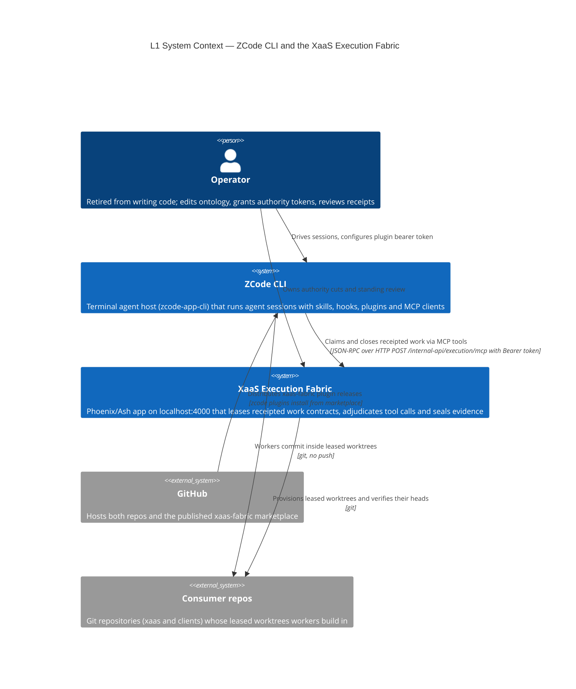
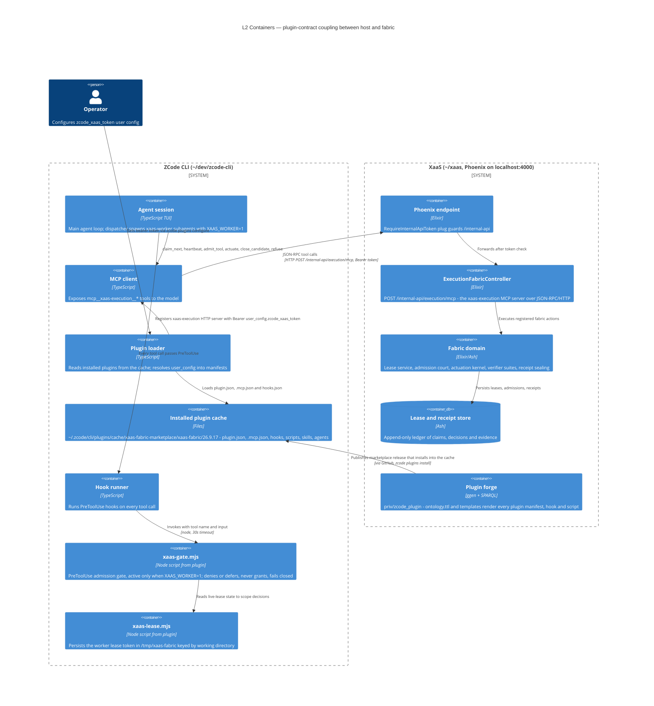
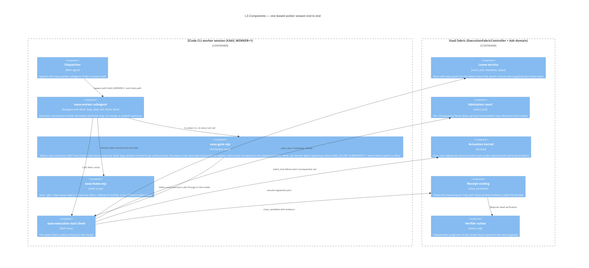

# C4 — zcode-cli ↔ xaas connections

Grounded in (2026-09-18):

- Plugin source (製-ed from ontology): `~/xaas/priv/zcode_plugin/` — `ontology.ttl`, ggen `templates/*.tmpl` (SPARQL-driven), rendered `marketplace/xaas-fabric/` (`plugin.json`, `.mcp.json`, `hooks/hooks.json`, `scripts/xaas-gate.mjs`, `scripts/xaas-lease.mjs`, `skills/xaas-worker/`, `agents/xaas-worker.md`, `commands/xaas.md`)
- Installed instance: `~/.zcode/cli/plugins/cache/xaas-fabric-marketplace/xaas-fabric/26.9.17/`
- Server side: `~/xaas/lib/xaas_web/router.ex:83` — `post("/execution/mcp", ExecutionFabricController, :mcp)` under `/internal-api`, behind `RequireInternalApiToken`
- Host contract: `~/dev/zcode-cli/docs/HOST_INTEGRATION.md` (plugin manifests, user_config interpolation)
- Headless session registration: project `.mcp.json` in the working directory (2026-09-21 runtime rebuild); see [CONFIGURATION.md](./CONFIGURATION.md), "Headless session registration: the project `.mcp.json`"

zcode-cli contains **zero** xaas-specific code; the entire coupling runs through three plugin contracts: the marketplace install, the `.mcp.json` MCP registration, and the `hooks.json` PreToolUse gate.

## L1 — System Context



## L2 — Containers



## L3 — Components (runtime enforcement and the claim protocol)



## Dynamic — one claim-to-receipt cycle

```mermaid
C4Dynamic
    title Dynamic — worker claim, admission, construction, receipt

    System_Boundary(host, "ZCode CLI") {
        Component(dispatcher, "Dispatcher", "Main agent")
        Component(gate, "xaas-gate.mjs", "PreToolUse gate")
        Component(worker, "xaas-worker", "Leased subagent")
        Component(mcp, "MCP client", "xaas-execution tools")
    }

    System_Boundary(fabric, "XaaS fabric") {
        Component(controller, "ExecutionFabricController", "MCP over HTTP")
        Component(domain, "Fabric domain", "Leases, court, kernel, receipts")
        Component(worktree, "Leased worktree", "Git worktree in a consumer repo")
    }

    Rel(1, dispatcher, worker, "Spawns with ticket path and XAAS_WORKER=1")
    Rel(2, worker, mcp, "claim_next")
    Rel(3, mcp, controller, "POST /internal-api/execution/mcp, Bearer token")
    Rel(4, controller, domain, "Grants lease-free epoch and lease token")
    Rel(5, worker, gate, "Every tool call admitted or denied on the host")
    Rel(6, worker, worktree, "Edits and commits inside the leased worktree, never pushes")
    Rel(7, worker, mcp, "admit_tool before each consequential call; heartbeat renews lease")
    Rel(8, worker, mcp, "close_candidate with head-verified evidence")
    Rel(9, domain, worktree, "Verifies the exact closed head and seals the receipt")
    Rel(10, dispatcher, worktree, "Coordinator merges one serialized --no-ff when clean, writer-free and test-green")
```

## Notes

- **No hard-coded coupling in zcode-cli**: the endpoint URL, server name, tool surface and token key all arrive via the installed plugin manifest, themselves rendered from `zp:` ontology facts by ggen SPARQL templates — editing the endpoint is an ontology edit in xaas, not a code change in zcode-cli.
- **Token path**: operator runs `zcode plugins configure xaas-fabric@<marketplace> --options-file`; the loader interpolates `user_config.zcode_xaas_token` into the `Authorization` header (the `${user_config.*}` form exists because install-time plugin contexts have empty `env`).
- **Two enforcement planes**: the server-side `admit_tool` court (per-consequence fence) and the host-side `xaas-gate.mjs` PreToolUse gate (active only in dispatcher-launched sessions). Both fail closed; the gate only ever denies or defers.
- **What each side can never do**: zcode-cli holds no ambient execution authority (a plugin tool call is not authority); the worker cannot push, spawn subagents, or write outside its leased worktree.
